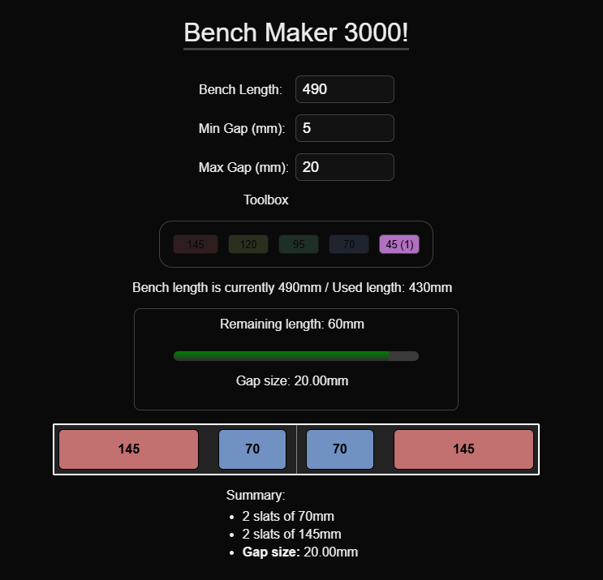

# BenchMaker 3000

### Overview

BenchMaker 3000 is a visual tool designed to help with furniture estimating, to determine how standardized wooden beams fit within a given bench width.

While this calculation can be done programmatically, raw numbers don’t provide an intuitive sense of symmetry. Additionally, the logic for optimal beam arrangement can be complex, involving recursion, material preferences (e.g., wider slats are easier to work with and more cost-effective), and ensuring visual uniformity and aesthetics.

### Why BenchMaker 3000?

* Interactive Bench Layout – Click on standardized slats or bricks to build a custom bench setup.
* Visual Symmetry Aid – Instantly see the alignment and proportions of different layouts.
* Drag & Drop Support – Easily rearrange slats for better aesthetic balance.
* Customizable Preferences – Define desired gap sizes and bench width for precise control.

### How It Works

1. Set Your Bench Width & Desired Gap Sizes – Define the constraints for your design.
2. Select Standardized Bricks/Slats – Click to add materials to your bench.
3. Drag & Drop to Rearrange – Adjust placement dynamically to refine symmetry.
4. Real-Time Feedback – The tool calculates used/remaining space and validates gap constraints automatically.

### Technology Stack

🛠 Next.js & React – Core framework for building the UI.

📦 @hello-pangea/dnd – Enables smooth drag-and-drop functionality.

### License

* This project is licensed under the MIT License.
* This project uses @hello-pangea/dnd, which is also licensed under the MIT License.

### Notes

* Slat/brick sizes are hardcoded right now, but system is flexible enough to accept and colorize any sort of array

### Screens

### Changelog

0.1.1

* Reworked spacing to use virutal gaps and fixed bench size (to better see unused space)
* Numerous CSS fixes
* Numeric and visual indicator for leftover planks to see if they still fit

0.1.2

* Made brick/slat array dynamic, implemented add button and two presets